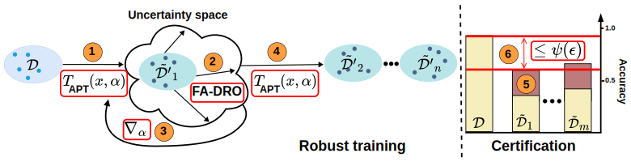

# Certified Robustness against Sensor Heterogeneity in Acoustic Sensing

## Abstract
Domain shifts due to microphone hardware heterogeneity pose challenges to machine learning-based acoustic sensing. Existing methods enhance empirical performance but lack theoretical understanding. This paper proposes Certified Adaptive Physics-informed transform (CertiAPT), an approach that provides formal certification on the model accuracy and improves empirical performance against microphone-induced domain shifts. CertiAPT incorporates a novel Adaptive Physics-informed Transform (APT) to create transformations toward the target microphone without requiring application samples collected by the target microphone. It also establishes a theoretical upper bound on accuracy degradation due to microphone characteristic differences on unseen microphones. Furthermore, a robust training method with an APT gradient update scheme leverages APT and certification constraints to tighten the upper bound and improve empirical accuracy across sensor conditions. Extensive experiments on three acoustic sensing tasks, including keyword spotting, room recognition, and automated speech recognition, validate CertiAPT’s certified robustness and show accuracy gains, compared with the latest approaches. 

<p align="center"></p>

## Dataset and Requirement

Please refer to [PhyAug](https://github.com/jiegev5/PhyAug) for the details.

## Outline
* [core.py](KWS/core.py): randomized smoothing on transformation space.
* [fadro.py](KWS/fadro.py): Frequency-Aware Distributionally Robust Optimization.
* [trans.py](KWS/trans.py): Adaptive Physics-informed Transform.
* [train.py](KWS/train.py): training code.
* [test.py](KWS/test.py): testing code.

Other files are adopted from [PhyAug](https://github.com/jiegev5/PhyAug). 

## Citation

```
@article{10.1145/3749481,
author = {Nguyen, Phuc Duc and Dai, Yimin and Li, Xiao-Li and Tan, Rui},
title = {Certified Robustness against Sensor Heterogeneity in Acoustic Sensing},
year = {2025},
volume = {9},
number = {3},
doi = {10.1145/3749481},
journal = {Proc. ACM Interact. Mob. Wearable Ubiquitous Technol.},
}
```

## Acknowledgments

[PhyAug](https://github.com/jiegev5/PhyAug)

